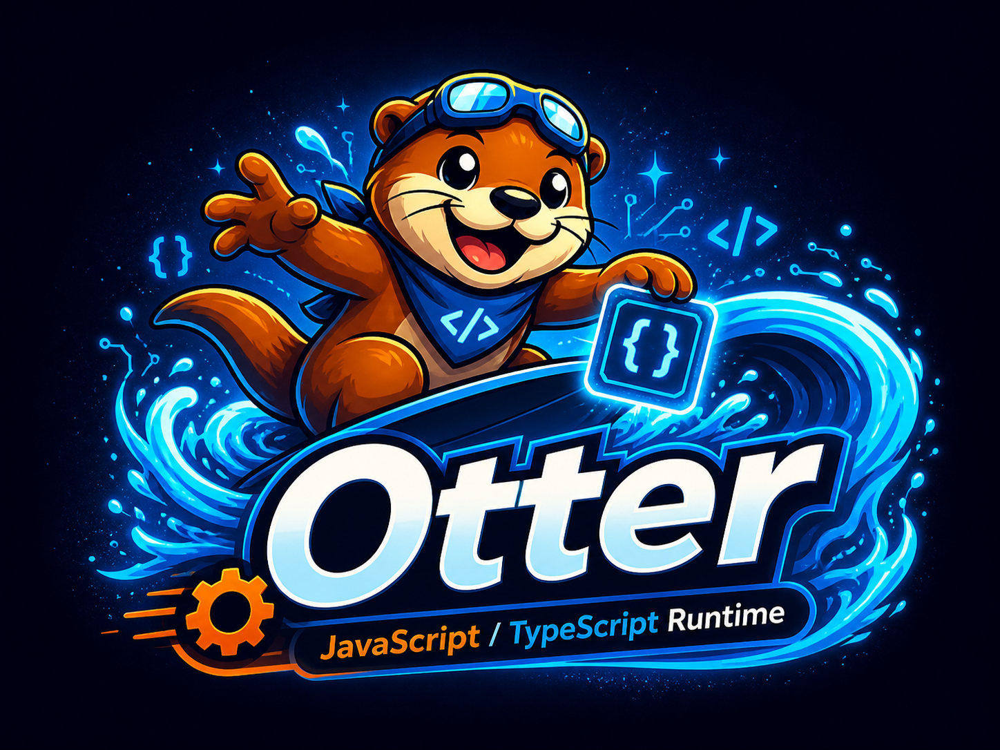

<p align="center">
  
</p>

# Otter

Embeddable TypeScript/JavaScript runtime and CLI powered by a custom bytecode VM.

## Overview

Otter is designed to embed scripting in Rust applications or run scripts directly from the CLI:

1. **Embeddable runtime** - Use `otter-runtime` as the active public embedding API
2. **Standalone CLI** - Run scripts with the `otter` binary (`otter-cli` crate)

The runtime is a custom VM with garbage collection, written in Rust. The current core crates are `otter-gc` + `otter-vm` + `otter-runtime`.

## Installation

### As a Rust library

```toml
[dependencies]
otter-runtime = "0.1"
```

### As a CLI

```bash
cargo install otterjs
```

## CLI Usage

```bash
# Create or update a package project
otter init -y
otter add left-pad
otter install
otter outdated

# Run a file, package script, or local package binary
otter run app.ts
otter app.ts                    # shorthand
otter run test                  # package.json#scripts.test
otter run eslint                # local node_modules/.bin/eslint

# Check and test through the same module resolver
otter check app.ts
otter test

# Diagnose without changing the package graph
otter --dump-bytecode=json app.ts

# Evaluate inline code
otter -e "console.log('hi')"

# Runtime info
otter info
```

The active developer loop is `init -> install/add/remove -> run/check/test -> diagnose/profile`.
`run` is the single execution command for files, package scripts, and package
binaries; there is no separate `exec` or `build` command in the current surface.
Otter writes `otter.lock`. When `otter.lock` is not present, `otter install`
can import `pnpm-lock.yaml`, `npm-shrinkwrap.json`, or `package-lock.json`,
materialize the recorded packages, and write the native lockfile.

### Permissions

Capability and host-integration work is still evolving. Expect this surface to keep growing as more hosted functionality lands directly on `otter-runtime`.

```bash
otter run app.ts --allow-read           # file system read
otter run app.ts --allow-write          # file system write
otter run app.ts --allow-net            # network access
otter run app.ts --allow-env            # environment variables
otter run app.ts --allow-all            # all permissions
```

## Embedding in Rust

```rust
use otter_runtime::{Runtime, SourceInput};

fn main() -> anyhow::Result<()> {
    let mut rt = Runtime::builder().build()?;
    rt.run_script(
        SourceInput::from_javascript("console.log('hello from otter-runtime')"),
        "main.js",
    )?;
    Ok(())
}
```

## Runtime Features (current)

- Custom bytecode VM + JS/TS compiler with TypeScript support out of the box
- Module/runtime host features live on `otter-runtime`
- Capability-based permissions remain a core design requirement
- Standards-facing Web APIs live in `crates/otter-web`, with host-side slices for `URL`, `Headers`, `Blob`, `Request`, and `Response`
- Otter-specific hosted modules live in `crates/otter-modules`, including importable `otter:kv`, `otter:sql`, and `otter:ffi`
- Core JavaScript builtins (Object/Array/Map/Set/Date/RegExp/JSON/Promise/Proxy/Reflect/Symbol, etc.)
- Test262 runner is active on the current runtime stack

## Status

Otter is actively evolving. Expect regular additions to the runtime surface as more host features land on `otter-runtime`.

## Project Structure

```text
crates/
├── otter-gc           # Active garbage collector
├── otter-vm           # Active VM, compiler, intrinsics
├── otter-runtime      # Active public runtime API
├── otter-modules      # Active otter:* hosted modules (kv/sql/ffi)
├── otter-web          # Active Web API crate
├── otter-test262      # Active conformance runner
└── otter-cli          # CLI binary
```

## Development

```bash
cargo build                              # debug build
cargo build --release -p otter-cli       # release CLI
cargo test --all                         # run tests
cargo run -p otter-cli -- run examples/basic.ts
```

## Benchmarks

Performance tracking uses standard JavaScript benchmark suites instead of local
microbenchmarks:

```bash
just bench              # V8 v7 + Octane smoke selection
just bench-v8           # classic V8 v7
just bench-octane       # full Octane
just bench-ares6        # BrowserBench ARES-6
just bench-web-tooling --only babel
```

See [`benchmarks/README.md`](benchmarks/README.md). Current curated scores live
in [`benchmarks/RESULTS.md`](benchmarks/RESULTS.md).

## License

MIT
