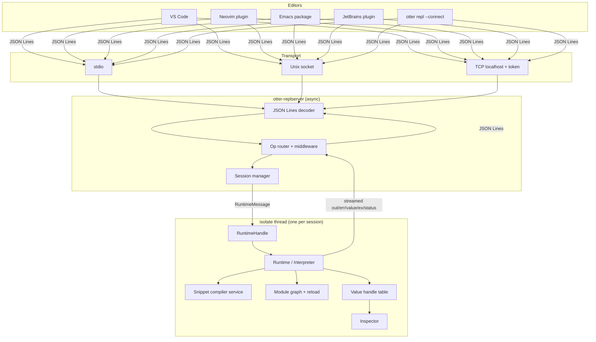

# JS/TS REPL-Driven DX Design

> Design owner: runtime tools track. Status: proposal. Targets the active
> `otter-cli` / `otter-runtime` / `otter-vm` stack. Greenfield where
> noted; breaking changes to compiler/VM/runtime are accepted.

---

## 1. Executive Summary

Otter ships its own JS/TS engine. The killer DX it can offer that
Node, Deno, Bun, and QuickJS cannot match without a rewrite is a
**Clojure-style REPL-driven workflow**:

- A long-lived runtime session you connect editors to — not a
  spawn-per-eval child process.
- Eval expression / selection / function / module / file with a single
  shortcut, results inline.
- A first-class **`Otter.replComment(() => { ... })`** form (analogue of
  Clojure `(comment ...)`) that lives next to production code, is
  evaluated by the editor on demand, and is **erased by the compiler in
  production builds with verifiable zero runtime cost**.
- A **public, nREPL-inspired message protocol** — JSON Lines over
  stdio / Unix socket / TCP localhost — so VS Code, Neovim, Emacs,
  JetBrains, and custom dashboards are all first-class clients.
  Otter is a *DX platform*, not a VS Code extension with a private API.

This doc nails down the UX, the protocol envelope and core ops, the
`Otter.replComment` semantics + compiler erasure pass, the runtime
session model, the engine changes required, the phased plan, and the
MVP scope. The MVP is small enough to ship, but already demonstrates
the end-to-end "eval inside a `replComment` from VS Code in a hot
runtime" workflow.

---

## 2. Prior Art Research

| Source | Useful ideas | Limitations | Adopt | Avoid |
|---|---|---|---|---|
| **Clojure nREPL** ([design](https://nrepl.org/nrepl/design/overview.html), [ops](https://nrepl.org/nrepl/ops.html)) | Message-oriented, `:id`/`:session`, multiple responses per request, `:status` terminal markers, `describe` for capability discovery, `interrupt` op, transport abstraction. | Bencode wire format is unfriendly to JS/TS plugin authors. EDN keyword bias adds friction outside Clojure. | Envelope shape, multi-response model, status terminal markers, capability discovery, op extensibility, session clone/close, interrupt by request id. | Bencode; EDN-only message values; assumption of dynamic Lisp namespace. |
| **CIDER** | Persistent connection, eval-defun-up-to-point, eval form / region / file / buffer, `*1`/`*2`/`*3` history, error overlays in source buffer, ns reload semantics. | Tightly coupled to Emacs; assumes Lisp form-at-point semantics. | "Eval current top-level node", inline result overlays, error decorations at original source span, session history. | Requiring a Lisp form-reader. |
| **Calva** ([connect](https://calva.io/connect/)) | "Jack-in" auto-launches REPL with deps; multiple parallel REPL connections routed by file globs; Rich Comment support; WebSocket option for browser runtimes. | Calva is a thick client because nREPL middleware ecosystem is sprawling. | Jack-in metaphor (`otter repl --server`), inline result UX, multi-target routing, code-lens above `replComment`. | Per-target middleware fragmentation. |
| **shadow-cljs** | Per-build runtime; REPL piggy-backs on a *running* JS app over WebSocket; `(shadow/repl :build-id)` to switch targets; hot reload over the same channel. | ClojureScript-specific; needs build watcher. | Piggy-back on a running Otter process; runtime/session switching; shared channel for reload + eval. | Browser-only assumptions. |
| **Node.js `node:repl`** ([docs](https://nodejs.org/api/repl.html)) | Programmatic `repl.start({input, output, eval, useGlobal, completer})`; pluggable evaluator with `Recoverable` for multi-line; `replServer.context` as a writable scope; `defineCommand`. | Single-process model; no remote protocol; scope is a regular global object. | Pluggable evaluator + `Recoverable` for incremental input; programmatic completer. | The bare-stdio-only assumption. |
| **Deno REPL** ([docs](https://docs.deno.com/runtime/reference/cli/repl/)) | Top-level await, `_` / `_error` specials, `--eval` / `--eval-file` to seed sessions, history file, `--inspect` for DevTools. | No editor protocol. No "send form to REPL". `_` only — no `*1`/`*2`/`*3`. | TLA support, seed flags, history file. | "Spawn a fresh REPL per editor command" model. |
| **Bun REPL** | Fast startup, JSC-backed eval. | Same Node-style limitations; no editor wire protocol. | Cold-start budget mindset. | n/a. |
| **QuickJS REPL** | Single-binary embedded REPL with `std`/`os`. | No protocol; no editor integration. | Embeddability. | n/a. |
| **TypeScript LSP / tsserver** | Stable JSON-RPC envelope, capabilities discovery, request/response with id, structured diagnostics with ranges. | LSP is request-scoped; not a great match for streaming `eval`. | JSON-based wire, JSON-RPC-style id correlation, structured diagnostics. | Forcing LSP semantics onto eval. |
| **Debug Adapter Protocol** | Standard editor wiring; many client libraries; structured stack frames, scopes, variables, evaluate request. | DAP is debugger-shaped: no first-class `eval-replComment`, no streamed `out`/`err` model with multiple terminal `status`. | DAP `Variable`/`Scope` ideas for the inspector. | Treating DAP as the REPL protocol. |
| **Rich Comments / `(comment …)`** | A trivial production-stripped block right next to production code. | Clojure macro magic. | The exact DX shape. | Anything macro-system-heavy. |

**Net takeaway.** nREPL's protocol *shape* is the closest fit. We
borrow the shape but use a JSON Lines wire format and a JS/TS-shaped
envelope so plugin authors in any editor can write a client in an
afternoon.

---

## 3. Current Repository Architecture

What exists today, with file:line for every claim. (Numbers point at
`main` as of the time this doc was written; treat as anchors, not
addresses.)

### 3.1 CLI surface — `crates/otter-cli`

- `Cli` clap parser at `crates/otter-cli/src/main.rs:46`; subcommand
  enum `Command` at `crates/otter-cli/src/main.rs:304`.
- Dispatch under `#[tokio::main(flavor = "current_thread")]` at
  `crates/otter-cli/src/main.rs:438`.
- Existing subcommands: `Run`, `Install`, `Add`, `Remove`,
  `Outdated`, `Init`, `Eval` (with `-p/--print`), `Check`, `Test`,
  `Info`. **No `repl`, no `--server`, no socket/IPC.**
- Direct-file shorthand: positional path → `RunTarget::File` at
  `crates/otter-cli/src/main.rs:488`.
- `-e` / `-p` short eval at `crates/otter-cli/src/main.rs:50–53`.
- Runtime construction: `cli_otter_builder` →
  `otter_runtime::Otter::builder()` at
  `crates/otter-cli/src/main.rs:579–585`.
- Module-loader plumbing per-entry: `cli_loader_config_for_entry` at
  `crates/otter-cli/src/main.rs:1013`.

### 3.2 Parser → Compiler → Bytecode

- Parser: `crates/otter-syntax`, wrapping `oxc_parser` with
  `SourceType::with_typescript(true)` (`crates/otter-syntax/src/lib.rs:64`).
- Source-kind detection: `detect_source_kind`
  (`crates/otter-syntax/src/lib.rs:81`) — `.ts/.mts/.cts → TypeScript`,
  `.tsx → TypeScriptJsx`, etc.
- Compiler crate: `crates/otter-compiler`. Entry `compile_source`
  (`crates/otter-compiler/src/lib.rs:184`) → `compile_program`
  (`crates/otter-compiler/src/lib.rs:256`) → AST visitor.
- Module mode: `compile_module_fragment` (`crates/otter-compiler/src/lib.rs:406`)
  takes a `ModuleHostInfo` with already-resolved import URLs.
- Single-pass AST → bytecode, no transform pipeline. Method-call
  routing: `compile_method_call`
  (`crates/otter-compiler/src/lib.rs:7166`) — this is the natural
  hook point for `Otter.replComment` recognition.
- TS handling is **transpile-only / erasure-only**:
  `unwrap_ts_expr` at `crates/otter-compiler/src/lib.rs:10055`,
  `is_erased_ts_statement` at `crates/otter-compiler/src/lib.rs:10069`.
  Decorators / `enum` / namespace-with-runtime-members emit the
  `TS_UNSUPPORTED` diagnostic.
- Bytecode container: `BytecodeModule` (`crates/otter-bytecode/...`).
  Constants pool is module-wide; per-function `SpanEntry` table
  carries source spans (`crates/otter-compiler/src/lib.rs:29–34`).
- **Existing `eval` lowering**: bare-`eval(expr)` emits `Op::Eval`
  (`crates/otter-compiler/src/lib.rs:7737–7756`), runtime-side
  `run_eval` at `crates/otter-vm/src/lib.rs:11489` invokes a
  host-installed `EvalHook`
  (`crates/otter-vm/src/lib.rs:2238`,
  `crates/otter-vm/src/lib.rs:3672`). Indirect-eval only — no
  module-context eval today.

### 3.3 VM execution

- `Interpreter`: `crates/otter-vm/src/lib.rs:2084`. Owns GC heap,
  string heap, microtask queue, module environments
  (`HashMap<Rc<str>, JsObject>`), eval hook, well-knowns, and the
  interrupt flag.
- Frame: `Frame` at `crates/otter-vm/src/lib.rs:1378`. Register
  window in `SmallVec<[Value; 8]>`. `module_url: Rc<str>`
  per-frame (used by import resolution — directly relevant to
  `eval-in-module-context`).
- Dispatch loop: `dispatch_loop` at
  `crates/otter-vm/src/lib.rs:4431`, body at
  `crates/otter-vm/src/lib.rs:4591`.
- Interrupt: `InterruptFlag` (`Arc<AtomicBool>`) at
  `crates/otter-vm/src/lib.rs:1347`, polled in `apply_branch`
  (`crates/otter-vm/src/lib.rs:15882`). Cooperative; cheap;
  back-edge only.
- Single-thread invariant: `assert_not_impl_any!(Interpreter: Send, Sync)`
  at `crates/otter-vm/src/lib.rs:147`.

### 3.4 Runtime / async / event loop

- `Otter` (public facade): `crates/otter-runtime/src/lib.rs:2371`.
  `Runtime` (isolate runner): `crates/otter-runtime/src/lib.rs:1325`.
- `RuntimeHandle` Send/Sync boundary:
  `crates/otter-runtime/src/handle.rs:114`. Bounded MPSC channel of
  `RuntimeMessage` (`crates/otter-runtime/src/handle.rs:165`) into
  the dedicated `"otter-isolate"` thread
  (`crates/otter-runtime/src/handle.rs:291`).
- Existing `RuntimeMessage` already carries
  `RunFile`/`RunScript`/`RunModule`/`Eval`/`CheckFile`/`Interrupt`
  (`crates/otter-runtime/src/handle.rs:329–414`). This is the
  natural transport for REPL session ops.
- Microtask drain: `drain_microtasks`
  (`crates/otter-vm/src/lib.rs:4019`); timer scheduler:
  `install_timer_scheduler`
  (`crates/otter-runtime/src/lib.rs:1401`); `EventLoop` trait:
  `crates/otter-runtime/src/event_loop.rs:68`.
- Run script vs run module:
  - `Runtime::run_script` (`crates/otter-runtime/src/lib.rs:2023`)
    captures last-expression value into `ExecutionResult` already.
  - `Runtime::run_module` (`crates/otter-runtime/src/lib.rs:2167`)
    drives the topo-ordered module init.
- Promises: `crates/otter-runtime/src/promise_registry.rs`.

### 3.5 Module loader, TS, diagnostics

- `ModuleLoader` (`crates/otter-runtime/src/module_loader.rs:462`)
  with oxc-resolver, supporting `file://`, `npm:`, `node:`,
  `https://`, and hosted `otter:` modules
  (`crates/otter-modules/src/lib.rs:35`).
- Module graph build: `build_module_set`
  (`crates/otter-runtime/src/module_graph.rs:187`) and link
  (`crates/otter-runtime/src/module_graph.rs:442`). Cache is
  `BTreeMap<String, ModuleNode>` keyed by canonical URL;
  **no eviction / reload API today**.
- TS is erased only; no transpile-only on-disk artefact.
  `tsx`/`jsx` parsing flag is wired but JSX lowering is incomplete.
- Errors: `OtterError` is `Serialize`/`Deserialize` already
  (`crates/otter-runtime/src/error.rs:34–100`). `Diagnostic`
  (`crates/otter-runtime/src/diagnostics/mod.rs:32`) carries `kind`,
  `code`, `message`, `source_url`, `range`, `frames`, `cause`.
- Stack frames: `snapshot_frames`
  (`crates/otter-vm/src/lib.rs:15649–15687`). Per-function span
  table allows PC → source span lookup
  (`crates/otter-runtime/src/lib.rs:981–999`).

### 3.6 What's already reusable

- `RuntimeMessage` channel + `RuntimeHandle` are essentially a
  ready-made request/response substrate. We extend the message enum
  with REPL ops; no thread-model changes.
- `OtterError`/`Diagnostic` are already JSON-serialisable. The
  protocol's `ex`/`diagnostics` payloads can serialise straight
  through.
- `EvalHook` already exists. We extend it with a `module_url`
  parameter to support `eval-in-module-context`.
- `InterruptFlag` already covers `interrupt`. We just need to expose
  a separate flag per session (one runtime per session in MVP).
- `Diagnostic.range` + `RuntimeSourceMapTable` already let us point
  errors back into original `.ts` source — including spans inside a
  `Otter.replComment` body.

### 3.7 What blocks REPL work today

- No reload-module / module-cache eviction surface.
- No virtual source registration (snippets need stable URLs).
- No "compile snippet against module env" — `EvalHook` is global-
  scope only.
- No `RuntimeMessage::Repl{Eval,EvalReplComment,Inspect,…}`
  variants.
- No value-handle table (every result is rendered to string and
  dropped).
- Interrupt is cooperative on back-edges only (good enough for MVP;
  flagged as a P1).
- `crates/otter-cli` lacks a `repl` subcommand.

---

## 4. Target User Experience

### 4.1 Terminal UX

```
$ otter repl
Otter v0.x — REPL session 9f3c
Project: ./otter.toml • capabilities: fs_read=. net=allow
Connect: stdio | unix:./target/otter.sock | tcp:127.0.0.1:7888 (token in ~/.otter/token)
> 1 + 2
3
> import { normalizeUser } from "./src/users.ts"
;; loaded ./src/users.ts in 18ms
> normalizeUser({ id: 1, name: "Alex" })
{ id: 1, name: "Alex", normalized: true }
> *1.id
1
> .reload ./src/users.ts
;; reloaded ./src/users.ts in 6ms
> .session
{ id: "9f3c", modules: 7, heap: "12.4 MB", uptime: "00:01:42" }
> .help
```

Persistent history file `~/.otter/repl-history`. `*1`/`*2`/`*3`
mirror previous results (CIDER convention; Deno only ships `_`).
Dot-commands are sugar over protocol ops.

### 4.2 Editor UX (VS Code as reference)

- `Cmd+Alt+J` — Jack-in: spawn `otter repl --server` for the
  current workspace, auto-connect.
- `Cmd+Alt+E` — Eval current expression at cursor.
- `Cmd+Alt+T` — Eval top-level statement / function / class.
- `Cmd+Alt+S` — Eval current selection.
- `Cmd+Alt+F` — Eval current file (as a snippet in module env).
- `Cmd+Alt+R` — Reload current module.
- `Cmd+Alt+C` — Eval the nearest `Otter.replComment` block.
- `Cmd+Alt+Shift+C` — Eval expression at cursor *inside* a
  `replComment` (uses the block's lexical context).
- `Cmd+Alt+I` — Inspect last value (lazy expand in side panel).
- `Cmd+Alt+.` — Interrupt running eval.

Result rendering:
- Inline ghost decoration with truncated repr after the evaluated
  span.
- Output panel `Otter REPL` for streamed `out`/`err`.
- Side panel `Otter Inspector` with lazy expand by `value-id`.
- Diagnostics inserted as red squiggle at the original `.ts` source
  span — including spans inside an erased `replComment`.
- Code-lens line above every `Otter.replComment(() => { … })`:
  `▶ Eval block` · `▶ Inspect` · `▶ Pin to scratch panel`.

### 4.3 The killer scenario in one screen

```ts
// src/users.ts
function normalizeUser(input: unknown) {
  // production code
  return { ...input as object, normalized: true };
}

Otter.replComment(() => {
  // ▶ Eval block (Cmd+Alt+C)
  const u = normalizeUser({ id: 1, name: "Alex" });
  u.id;          // ▶ Eval expression (Cmd+Alt+E) → 1 (inline)
  u;             // → { id: 1, name: "Alex", normalized: true }
});
```

Production build of `src/users.ts` contains `normalizeUser` only.
The `Otter.replComment` body is dropped at the bytecode-emit stage;
imports referenced *only* from inside the block are dropped from the
emitted module record; `otter check --repl-comments` and the
production `otter build` step both fail loudly if any erasure was
missed.

---

## 5. REPL Architecture

### 5.1 Components

| Component | Lives in | Responsibility |
|---|---|---|
| **CLI front-end** | `crates/otter-cli` | New `otter repl` / `otter repl --server` / `otter repl --connect` / `otter eval` / `otter check --repl-comments` subcommands. |
| **Otter nREPL server** | new `crates/otter-replserver` | Owns transports (stdio, Unix socket, TCP localhost). Speaks the protocol envelope. Pure async; no JS execution. |
| **Session manager** | new `crates/otter-replserver` | Maps `session-id` → `RuntimeHandle`. Spawns, clones, closes. Tracks request → session for `interrupt`. |
| **Runtime session** | reused `crates/otter-runtime::Runtime` | One per session. Already single-threaded behind `RuntimeHandle`. |
| **Snippet compiler service** | new module in `crates/otter-runtime` | `compile_snippet(source, kind, module_url, options)` → `BytecodeModule` plus span/source-map metadata. |
| **REPL comment compiler pass** | new pass in `crates/otter-compiler` | Recognises `Otter.replComment(() => {…})` calls. Extracts the body as a virtual snippet keyed by source span. Erases the call from emitted bytecode. |
| **Value handle table** | new field on `Runtime` | `ValueId → Value` with rooting + LRU + explicit `release-value`. |
| **Inspector** | new module in `crates/otter-runtime` | Pretty-print + lazy-expand renderer for protocol values. |
| **VS Code client** | new `editor/vscode` | Thin client over the protocol. No bespoke wire: every other editor reuses the same envelope. |
| **Third-party clients** | external | Same envelope. |

### 5.2 Diagram



### 5.3 Process model

- **MVP**: one `Runtime` per `session-id`, all sessions hosted in one
  CLI process; one `tokio::current_thread` runtime per session, on a
  dedicated OS thread (mirrors today's `"otter-isolate"` thread).
  Concurrency is intra-server: many sessions, each serial. Matches
  the existing single-thread invariant
  (`crates/otter-vm/src/lib.rs:147`).
- **Production**: same model; with a process-level cap on concurrent
  sessions and a per-session memory cap reusing
  `RuntimeBuilder::max_heap_bytes` (`crates/otter-runtime/src/lib.rs:1103`).
- We do **not** introduce in-process multi-threading inside a
  session. Multi-runtime is at the session level only.

---

## 6. Runtime Session Model

### 6.1 What a session owns

A session is `(session_id, RuntimeHandle, capabilities, scratch_module_url, value_handles, history)`.

- `RuntimeHandle` already routes commands into a single isolate
  thread (`crates/otter-runtime/src/handle.rs:114`). We add new
  `RuntimeMessage` variants for REPL ops (see §16).
- Each session has a synthetic **scratch module** with URL
  `otter-repl://session/<session-id>/scratch.ts`. This is the eval
  context for `eval` ops that don't specify a `file`. Imports the
  caller wants are explicit `import` statements, lowered against the
  module loader exactly like a real module.
- Project module graph lives in the same `Runtime`. `eval-file` /
  `eval-module` snippets compile against an existing module's URL
  using the snippet compiler with `host_info.module_url = <target>`.

### 6.2 Globals, scope, and re-declaration

- Top-level `let`/`const` in the scratch module are pre-declared the
  way our compiler already does for top-level globals (memory:
  Annex B + top-level lexical predeclare). Re-declarations re-bind
  in the scratch module — the snippet compiler treats the scratch
  module as an *open* module that grows append-only across snippets
  with explicit upvalue carry-over.
- `*1`/`*2`/`*3` are pre-declared scratch-module bindings; the
  protocol layer rebinds them after each successful eval.
- `import { x } from "./y.ts"` inside an eval re-uses the existing
  module loader; if the module is already loaded, the live module
  environment is reused. (We do NOT silently reload it; reload is
  explicit via `reload-module`.)

### 6.3 Eval-in-module-context

- New `EvalHook` signature carries `module_url`:
  ```rust
  pub type EvalHook = Rc<dyn Fn(
      &str,
      EvalCompileOptions { module_url: Option<Rc<str>>, ... }
  ) -> Result<BytecodeModule, String>>;
  ```
- `Runtime` builds the `EvalCompileOptions` from the request's
  `file`/`module` fields. Snippet compiler resolves imports and
  binds private/non-exported declarations of the target module via
  the same upvalue mechanism modules already use
  (`crates/otter-compiler/src/lib.rs:435–438`).
- The snippet's last expression is captured as the completion value
  — the existing `Runtime::run_script` already does this
  (`crates/otter-runtime/src/lib.rs:2023`). For module-context eval
  we extend the contract so the *last expression of a Statement
  list* — even if not the only statement — becomes the completion.

### 6.4 Top-level await

- The snippet compiler tags any snippet containing top-level `await`
  as an async snippet. The runner returns a `Promise` that the
  protocol layer awaits before emitting the terminal `value`/`ex`.
- Microtasks already drain after each top-level run via
  `drain_microtasks` (`crates/otter-vm/src/lib.rs:4019`); REPL eval
  uses the same drain plus a future bridge for unsettled promises.

### 6.5 Reset and reload

- `reset-session` drops the scratch module + value handles, clears
  `module_environments`, recreates the scratch module. It does
  **not** restart the OS thread — the `Runtime` is reused.
- `reload-module` evicts a single URL from the module graph cache
  and re-runs its initializer. This requires a new eviction surface
  (see §16); today the cache is monotonic
  (`crates/otter-runtime/src/module_graph.rs:193`). Re-binding of
  importers happens only for code compiled *after* reload — old
  closures keep their old references. This matches shadow-cljs
  semantics and is documented.

### 6.6 Stale-state hazards and how we mitigate

- **Closure capture of old bindings**: documented; users who care
  use `Otter.replComment` blocks that re-import.
- **Mutable module state**: `reload-module` runs the initializer
  again, reinitialising mutable module-level state. The user can
  opt out by passing `{ preserve_state: true }`.
- **GC of long-lived value handles**: every handle has a TTL +
  explicit `release-value`; eviction policy is LRU bounded by
  `repl.value_handle_cap`.

### 6.7 Interrupt / cancel semantics

- `interrupt` op trips the session's `InterruptFlag`
  (`crates/otter-vm/src/lib.rs:1347`) and emits status
  `["interrupted", "done"]` on the running request.
- Tight loops without back-edges are a known limitation; P1 work
  adds an instruction-counter budget tick in `dispatch_loop_inner`
  (`crates/otter-vm/src/lib.rs:4591`) — see §16.

---

## 7. TypeScript Incremental Evaluation

### 7.1 Eval the way the engine compiles the rest of the codebase

We do **not** introduce a separate transpile-to-JS path. The
existing `otter-compiler` already eats TS via `oxc_parser` with
`SourceType::with_typescript(true)` and erases types in-tree
(`crates/otter-compiler/src/lib.rs:10055–10094`). REPL snippets go
through the same pipeline so that:

- semantics match production execution exactly,
- diagnostic codes (`TS_UNSUPPORTED`, `SYNTAX_ERROR`, …) match,
- spans flow into the same source-map table.

### 7.2 Snippet caching strategy

- Cache key: `(snippet_text_hash, module_url, compile_flags)`.
- LRU bounded by snippet count + total bytecode bytes.
- Cache lives on `Runtime` and is wiped by `reset-session`.
- **Why this is enough**: most REPL snippets are tiny; module-level
  parse cost dominates only on the first import. Module compilation
  reuses the existing module graph cache.

### 7.3 No type-checking on the hot path

- REPL eval is **transpile-only** by default. `otter check` remains
  the home of any future type-checking pass.
- Protocol exposes `mode: "transpile" | "check" | "both"` on
  `eval` and `eval-replComment`. `check` and `both` route through
  the same path the future `otter check` work uses; for now
  unsupported and reported via `unsupported` status.

### 7.4 Spans inside `Otter.replComment`

- The compiler pass that recognises `Otter.replComment` (see §8)
  records the *body's* span in a per-module `ReplCommentTable`.
- When a snippet derived from a `replComment` body is compiled, its
  `SpanEntry` table is rebased onto the original `.ts` file so any
  runtime error frame already points at the right line/column —
  reusing `RuntimeSourceMapTable::resolve_frame_span`
  (`crates/otter-runtime/src/lib.rs:981`).

### 7.5 Project-aware imports

- Snippet compiler reuses the per-entry loader config produced by
  `cli_loader_config_for_entry`
  (`crates/otter-cli/src/main.rs:1013`) so bare specifiers resolve
  exactly like in `otter run`.

---

## 8. REPL Comment Form

### 8.1 API recommendation

**Use `Otter.replComment(() => { ... })`.**

Rationale:

- Matches the user-facing Clojure analogue (`(comment ...)`) without
  ambiguity — the name screams "REPL-only".
- Compiler-recognised callsite, not a macro: implementation is a
  small visitor in `compile_method_call`
  (`crates/otter-compiler/src/lib.rs:7166`); no parser changes; no
  TS transformer plug-in; works in any `.ts` / `.js` file with no
  build-system gymnastics.
- A regular call expression typechecks (with a minimal `.d.ts`) and
  Go-To-Definition still works in editors that don't speak the Otter
  protocol.
- Easy to grep: a third-party plugin can locate every block with
  `grep -n 'Otter\.replComment'` if it wants a non-protocol fallback.
- We expose the Otter global the same way Deno exposes `Deno`.

Alternatives considered and rejected for MVP:

| Form | Reject because |
|---|---|
| `Otter.comment(() => …)` | Clashes with user expectations from JS (a comment is `//`); "comment" is overloaded. |
| `Otter.dev(() => …)` / `Otter.scratch(() => …)` | Clear but loses the explicit "this is REPL-evaluable" signal. Could be aliases later. |
| Tagged template `` Otter.repl`…` `` | Untypeable contents; loses TS checking; harder to eval expression-at-cursor. |
| Block-comment pragma (`/* @otter-repl */ { … }`) | Hostile to TS parser, hostile to formatters, no first-class symbol to grep / refactor. |
| Custom keyword `replcomment { … }` | Requires parser extension; breaks oxc; rejected. |

`Otter.dev` and `Otter.scratch` may be added later as aliases that
lower to the same intercept; not in MVP.

### 8.2 Surface contract

```ts
declare namespace Otter {
  /**
   * Dev-only block. Compiler-recognised. Erased from production builds.
   * The thunk is **never invoked at runtime** — even in dev — by the
   * normal execution path. It runs only when an Otter REPL/editor
   * client asks the runtime to eval it.
   *
   * Accepts an arrow function or function expression. Async is allowed.
   * Top-level await inside the body is allowed.
   */
  function replComment(body: () => void | Promise<void>): void;
  function replComment(body: () => unknown | Promise<unknown>): void;
}
```

The static contract: **at runtime, calling `Otter.replComment` is a
no-op**. Even before erasure (debug builds where the user disables
the pass), the Otter intrinsic does nothing. This guarantees
behavioural equivalence between debug and production: the body never
runs unless a REPL client explicitly invokes `eval-repl-comment`.

### 8.3 Compiler semantics

The pass lives in `otter-compiler` and runs during the existing AST
walk — there is no new transform pass.

1. **Detection.** In `compile_method_call`
   (`crates/otter-compiler/src/lib.rs:7166`), recognise
   `MemberExpression(object: Identifier("Otter"),
   property: Identifier("replComment"))` callsites whose first
   argument is an `ArrowFunctionExpression` or
   `FunctionExpression`. Reject with `REPL_COMMENT_INVALID_ARG`
   diagnostic if the argument is anything else.
2. **Emit.** Emit **nothing** for the call expression. The
   `Otter.replComment(...)` callsite vanishes from the bytecode
   stream. Its source span is preserved only in the
   `ReplCommentTable`.
3. **`ReplCommentTable`.** Per `BytecodeModule`, a new field:
   ```rust
   pub struct ReplCommentEntry {
       pub id: u32,             // stable ordinal in source order
       pub body_span: Span,     // original byte range of the function body
       pub captures: Vec<UpvalueRef>,  // names referenced inside the body
       pub is_async: bool,
   }
   pub struct BytecodeModule {
       ...
       pub repl_comments: Vec<ReplCommentEntry>,
   }
   ```
4. **Captures.** Same upvalue analysis the compiler already does for
   nested closures, but the upvalue *materialisation* is deferred:
   the body is compiled lazily on `eval-repl-comment`, against the
   live module environment. The detection pass only records the
   *names* referenced so we know which module bindings to keep alive.
5. **Imports kept alive only by replComment**. Compiler tracks
   per-import "external user count" vs "replComment user count". An
   import referenced only inside `Otter.replComment` bodies emits a
   diagnostic in production builds (`REPL_COMMENT_DEAD_IMPORT`) and
   is dropped from the emitted module record. In dev builds it is
   kept so the body stays evaluatable.
6. **Nested `Otter.replComment`.** Allowed; nested entries get
   nested `id`s. Editor clients address them as `id` integers, not
   span-arithmetic.
7. **Async / TLA inside body.** Body is treated as an async snippet
   (§6.4). `await` at body top level is legal.
8. **Disabling the pass.** A debug-only flag
   `--repl-comments=keep-empty-call` keeps the call as
   `void 0;` — for diffing the bytecode shape; default is `strip`.
9. **Source maps.** Spans inside the body are rebased (§7.4).
10. **No `eval`-style escape hatch.** The body cannot reference
    private compiler globals. It is normal JS/TS.

### 8.4 Production erasure verification

A production build runs the same compiler pass. To detect mistakes:

- **Bytecode verifier.** New pass in `otter-bytecode` walks every
  emitted function and asserts no instruction references a
  `Otter.replComment` symbol or a `ReplCommentEntry` body. This is
  a simple symbol scan over the constants pool plus a check that
  `BytecodeModule.repl_comments` is empty after erasure in
  `--release` builds. Fails the build with
  `REPL_COMMENT_NOT_ERASED`.
- **`otter check --repl-comments`.** New CLI subcommand: parses the
  project, finds every `Otter.replComment` call, reports invalid
  arguments / nested-only imports / parse errors inside bodies.
  Zero exit = ready for production.
- **`otter build --strip-repl-comments=verify` (default in
  `--release`)**: the build fails if the bytecode contains any
  reachable code from a `Otter.replComment` body, or any module
  record contains a `ReplCommentEntry` after the erasure pass.

### 8.5 Editor / nREPL semantics

The protocol op `eval-repl-comment` carries `{ file, repl_comment_id }`
or `{ file, line, column }` (the server resolves to nearest enclosing
entry). The op:

1. Looks up the file's `ReplCommentTable`.
2. Compiles the body as a snippet against the file's module URL,
   pulling captures from the live module environment.
3. Runs it under the session's interrupt flag.
4. Streams `out`/`err`, returns `value` (last expression) and
   terminal `status`.

Sub-expression eval inside a body uses `eval-selection` with
`{ file, range }`; the snippet compiler still rebases against the
enclosing `replComment`'s lexical context.

### 8.6 Worked example

```ts
// src/users.ts
import { findUser, db } from "./db.ts";

export function normalizeUser(input: unknown) {
  return { ...(input as object), normalized: true };
}

Otter.replComment(async () => {
  const u = await findUser(1);
  normalizeUser(u);                  // ← Cmd+Alt+E
  await db.transaction(async tx => { // ← Cmd+Alt+T
    return tx.query("select 1");
  });
});
```

Production build of `src/users.ts`:

- Bytecode contains `normalizeUser` only.
- The `import { findUser, db } from "./db.ts"` is kept iff
  `findUser`/`db` are also referenced from production code; otherwise
  it is dropped and `REPL_COMMENT_DEAD_IMPORT` is emitted (warning,
  upgradable to error via project config).

### 8.7 Acceptance criteria

1. `Otter.replComment(() => {…})` compiles in `.ts` and `.js`.
2. VS Code can `eval-repl-comment` the block in a running session.
3. Any compliant Otter nREPL client can do the same via the protocol.
4. The body has access to the module's lexical scope, including
   non-exported declarations.
5. Production build emits zero bytecode for the body.
6. Final `BytecodeModule.repl_comments` is empty in `--release`.
7. The bytecode verifier fails the build if (5) or (6) regress.
8. Errors inside the body point at the original `.ts` source span.
9. No new parser / macro infrastructure is required.

### 8.8 Risks

- **Dynamic capture surprises** if the user mutates module state
  inside the body and expects the change to persist after eval.
  Mitigation: documented; module mutations *do* persist (they're
  real module-level mutations); `reset-session` is the escape.
- **Non-obvious erasure when the user reaches `Otter.replComment`
  via aliasing**: `const c = Otter.replComment; c(() => {...})`.
  The compiler intercept only matches direct `Otter.replComment`.
  Mitigation: lint rule + diagnostic when an alias is detected
  (`REPL_COMMENT_ALIASED`). Production aliasing of an erased symbol
  is a production runtime error today (`Otter.replComment` is
  undefined in `--release`), making the lint a nice-to-have.

---

## 9. Otter nREPL Protocol Specification

### 9.1 Goals

- **Editor- and plugin-friendly**: any plugin author with a JSON
  parser and a socket can write a client.
- **Transport-independent**: stdio, Unix socket, TCP localhost
  (token-authenticated), WebSocket (later).
- **Session-based**: persistent runtime per session; multiple
  sessions per server.
- **Extensible**: new ops added without breaking clients;
  capability discovery via `describe`.
- **Streamable**: multiple response messages per request, terminated
  by a `status` containing `"done"`.
- **Stable**: SemVer-backed wire-format versioning.

### 9.2 Why nREPL-inspired and not LSP/DAP

| Aspect | Otter nREPL | LSP | DAP |
|---|---|---|---|
| Streaming output | First-class (`out`/`err` messages, terminal `status`) | Awkward (`window/logMessage`, no per-request stream) | Yes (`output` event) but tied to debug session |
| Sessions | First-class | None | One per debug |
| Capability discovery | `describe`/`runtime-info` ops | `initialize` capabilities | `initialize` capabilities |
| Eval | First-class (`eval`, `eval-replComment`, …) | None | `evaluate` request only |
| Interrupt | First-class | n/a | `pause`/`terminate` (debugger-shaped) |
| Hot reload | First-class (`reload-module`) | None | n/a |
| Adopters can write a 200-line client | Yes | No (LSP is huge) | No (DAP is huge) |

LSP and DAP can run **alongside** the Otter nREPL protocol — they
solve different problems (completion + diagnostics; step-debugging).
They are not REPL protocols.

### 9.3 Transport

- **MVP**: JSON Lines over **stdio** (one JSON object per line,
  UTF-8). Identical framing on Unix domain socket and TCP localhost.
- **Discovery**: `otter repl --server` writes a JSON file
  `./.otter/repl/<server-id>.json` with `{transport, address, token,
  pid, started_at}`. Clients tail the directory. (Same trick
  shadow-cljs uses with `.shadow-cljs/sockets/`.)
- **TCP/WebSocket**: require a 32-byte hex token in the first
  message (`op: "auth"`) or via a header (WebSocket). Token is
  generated per-server, written to the discovery file, file mode
  0600.
- **Why JSON Lines and not bencode**: every editor's standard
  library has JSON; bencode is a write-it-yourself tax.
- **Why not HTTP-only**: streaming responses are awkward over
  HTTP/1.1 keepalive; SSE is OK but adds framing layers for no
  benefit. JSON Lines over a duplex socket is the simplest thing
  that works for every editor.

### 9.4 Envelope

```json
{ "id": "<request-uuid>",       "// required for requests" : "",
  "session": "<session-id>",    "// required after the first response" : "",
  "op": "<op-name>",            "// required for requests" : "",
  "...": "op-specific fields" }
```

Responses echo `id` and `session`. A request may produce **N
response messages**. The final message MUST contain a `status` array
that includes `"done"` (terminal status). Other status values may
also appear.

```json
{ "id": "...", "session": "...",
  "value": "{\"answer\":42}",
  "valueMeta": { "kind": "object", "preview": "{ answer: 42 }",
                 "valueId": "v_3a91", "truncated": false } }

{ "id": "...", "session": "...",
  "out": "ready\n" }

{ "id": "...", "session": "...",
  "ex": "TypeError",
  "message": "x is not a function",
  "diagnostics": [ /* see §9.7 */ ],
  "status": ["eval-error", "done"] }
```

Field reference (top-level):

| Field | Kind | Notes |
|---|---|---|
| `id` | string | Required on requests; echoed on responses. UUIDv4 recommended. |
| `session` | string | Required on session-bound ops. Server returns `"unknown-session"` status if missing/invalid. |
| `op` | string | Required on requests. Unknown → `"unknown-op"` status. |
| `value` | string | Pretty-printed result of the last expression. JSON-encoded JS value when possible; otherwise an inspector preview. |
| `valueMeta` | object | `{kind, preview, valueId?, truncated?, ttl?}`. See §13. |
| `out`/`err` | string | Streamed stdout/stderr from the snippet. |
| `ex`/`message` | string | Exception name + message. |
| `diagnostics` | `Diagnostic[]` | Same shape as `crates/otter-runtime/src/diagnostics/mod.rs:32`. |
| `status` | string[] | Terminal markers. Always includes `"done"` on the last message of a request. |
| `progress` | object | Optional `{phase, current, total}` for long ops (e.g. `reload-module`). |
| `protocol` | string | SemVer; `"1.0"` for the first stable release. |

### 9.5 Status keywords

| Status | Meaning |
|---|---|
| `done` | Terminal marker; appears on the last message of every request. |
| `need-input` | Server wants a `stdin` op for this request. |
| `interrupted` | Cancelled via `interrupt`. Implies `done`. |
| `eval-error` | Exception thrown during snippet execution. |
| `compile-error` | Snippet failed to compile. `diagnostics` populated. |
| `runtime-error` | Non-JS host error (heap-cap exceeded, native crash, …). |
| `transport-error` | Protocol-level malformed message. |
| `unknown-op` | Server does not know this `op`. |
| `session-closed` | Op targeted a closed session. |
| `unknown-session` | `session` field references no live session. |
| `invalid-request` | Required fields missing / wrong type. |
| `unsupported` | Op known but disabled by capability or build flag. |
| `timeout` | Snippet exceeded `repl.eval_timeout`. |
| `out-of-memory` | Heap cap tripped (mirrors test262 `OutOfMemory`). |
| `paused` | Debugger paused execution (future, when DAP rides alongside). |

Combinations (always end with `done`):
`["interrupted","done"]`, `["eval-error","done"]`,
`["compile-error","done"]`, `["timeout","done"]`,
`["unsupported","done"]`, `["unknown-op","done"]`.

### 9.6 Core ops

For each op: request fields (R required, O optional), response
fields, status values, streaming behaviour.

#### `describe`

R: `op`. O: `verbose: bool`.
Response (single message):
```json
{ "id":"...", "session":"...", "protocol":"1.0",
  "implementation": { "name":"otter", "version":"0.x.y" },
  "transports": ["stdio","unix","tcp"],
  "encodings": ["json-lines"],
  "ops": { "eval":{}, "eval-repl-comment":{}, ... },
  "capabilities": {
      "repl_comment": true,
      "interrupt": "back-edge",
      "module_reload": true,
      "value_handles": true,
      "top_level_await": true,
      "typescript": "transpile-only",
      "type_check": false,
      "inspector": "lazy-expand",
      "completions": "experimental",
      "debugger": false
  },
  "experimental_ops": ["otter.profile/start","otter.profile/stop"],
  "status":["done"] }
```
Status: `done`.

#### `clone`

R: `op`. O: `session` (parent — copies scratch module + value
handles snapshot).
Response: `{ "new-session": "<id>", "status":["done"] }`.

#### `close`

R: `op`, `session`.
Response: `{ "status":["session-closed","done"] }`.
Server frees the runtime thread + value handles.

#### `sessions`

R: `op`. Response: `{ "sessions":[ "id1","id2",... ], "status":["done"] }`.

#### `eval`

R: `op`, `session`, `code`. O: `file`, `module` (URL — overrides
`file`-derived URL), `line`, `column`, `mode`
(`"transpile"|"check"|"both"`, default `"transpile"`),
`captureOutput` (default true), `valueLimit` (`{depth,length}`),
`timeout` (ms; falls back to session default).
Streamed responses: zero or more `out`/`err`; up to one `value`
(`+valueMeta`); final `status`.
Statuses: `done`, `eval-error`, `compile-error`, `interrupted`,
`timeout`, `out-of-memory`.

#### `eval-selection`

R: `op`, `session`, `file`, `range: {start, end}` (byte offsets) OR
`{startLine, startColumn, endLine, endColumn}`.
Server slices the source, snippet-compiles against `file`'s module
URL. Otherwise identical to `eval`.

#### `eval-file`

R: `op`, `session`, `file`. O: `code` (override file content for
unsaved buffers). Compiles the file as a snippet in *its own module
context*; equivalent to `import "file://…"` if the file is already
loaded, otherwise loads it. Returns last-expression value.

#### `eval-module`

R: `op`, `session`, `module` (URL).
Like `eval-file` but addresses a module that may not have a
filesystem path (hosted module, virtual module).

#### `eval-repl-comment`

R: `op`, `session`, `file`. O: `id` (ordinal in `ReplCommentTable`),
`line`+`column` (server resolves to nearest enclosing entry).
Compiles the recorded body as a snippet against `file`'s module
context. Body's last expression becomes `value`. Async bodies
are awaited.

#### `eval-all-repl-comments-in-file`

R: `op`, `session`, `file`. O: `parallel: false`.
Sequentially evaluates every `ReplCommentEntry`. Streams one
`value` per entry, each tagged with `replCommentId` in `valueMeta`.
Terminates with a single terminal `status`.

#### `reload-module`

R: `op`, `session`, `module` (URL). O: `preserve_state: false`,
`reinit: true`.
Evicts the module from the cache, re-parses, re-compiles, runs
initializer. Streams `progress` for long graph re-walks.
Status: `done`, `compile-error`, `runtime-error`.

#### `interrupt`

R: `op`, `session`. O: `interrupt-id` (request id to cancel; if
omitted, cancels the running request in that session).
Response: `{ "status":["done"] }` if the trip succeeded;
`["session-idle","done"]` if nothing was running;
`["interrupt-id-mismatch","done"]` if `interrupt-id` is stale.

#### `reset-session`

R: `op`, `session`. O: `keep_modules: false`.
Drops scratch module + value handles + (optionally) module
environments. Returns `{ "status":["done"] }`.

#### `inspect-value`

R: `op`, `session`, `valueId`. O: `path: string[]` (drill-down),
`limit: {depth, length}`.
Returns a structured `inspection` payload; see §13. `valueId`
remains alive until `release-value` or TTL expiry.

#### `release-value`

R: `op`, `session`, `valueId` (or `valueIds: string[]`).
Drops the GC root. `done`.

#### `complete`

R: `op`, `session`, `code`, `cursor` (offset). O: `file`.
Returns `{ completions: [{label, kind, detail, insertText, ...}],
status:["done"] }`. MVP: best-effort lexical completions from the
session scratch module + module exports; richer LSP-grade
completion is `experimental_ops["otter.lsp/complete"]`.

#### `diagnostics`

R: `op`, `session`. O: `file`.
Returns the latest `Diagnostic[]` for the session (or filtered to a
file). Emitted automatically after each compile failure; explicit
op is for clients that connect after the fact.

#### `runtime-info`

R: `op`, `session`.
Returns `{ heap, modules, capabilities, uptime, version, isolate_id,
gc_stats, ... }`. Mostly a debug op.

#### `session-state`

R: `op`, `session`.
Returns `{ scratch_module, defined_globals: [...], history: [...],
value_handles: [...] }`. Cheap snapshot for editor restore.

#### `stdin` (optional core)

R: `op`, `session`, `id` (the request that emitted `need-input`),
`stdin`.
Routes the bytes into the snippet's `stdin`-like channel.

#### `auth` (TCP/WebSocket only)

R: `op`, `token`. Must be the first message on the connection.
Response: `{ "status":["done"] }` or `["unauthorised","done"]`
followed by connection close.

### 9.7 Diagnostics shape

Reuse `crates/otter-runtime/src/diagnostics/mod.rs:32`, which is
already `serde::Serialize`. Wire shape:

```json
{
  "kind": "Error",
  "code": "TS_UNSUPPORTED",
  "message": "...",
  "source_url": "file:///abs/path.ts",
  "range": { "start": 312, "end": 325 },
  "help": "...",
  "frames": [
    { "function_name": "normalizeUser",
      "module": "file:///abs/path.ts",
      "span": { "start": 102, "end": 117 } }
  ],
  "cause": null,
  "aggregated_errors": []
}
```

### 9.8 Sessions

- `clone` produces an isolated session sharing nothing with its
  parent except (optionally) a snapshot of the parent's *value
  handles* — useful for "open a clean side scratch but keep my
  current values".
- `close` drops the runtime thread.
- `reset-session` keeps the runtime thread but resets state.
- `sessions` enumerates live sessions. Useful for editors that
  reconnect.

### 9.9 Middleware / extension model

The server is a chain of middleware functions over a `Request →
Stream<Response>` handler. Built-in core middleware:

1. `auth` — for non-stdio transports.
2. `session` — resolves `session` to a `RuntimeHandle`, returns
   `unknown-session`/`session-closed` cleanly.
3. `interrupt-routing` — tracks in-flight requests so `interrupt`
   can find them by id.
4. `value-handles` — wraps `value`/`valueMeta` injection and
   `inspect-value`/`release-value`.
5. `pretty-print` — final stage; serialises Otter `Value`s into
   protocol payloads.
6. `eval` / `eval-repl-comment` / `reload-module` / `inspect-value`
   handlers.

Third-party middleware register declaratively:

```rust
ReplServer::builder()
  .middleware(auth)
  .middleware(session)
  .middleware(my_profiler_middleware)   // adds otter.profile/* ops
  .build()
```

Custom ops live under a namespace prefix
(`otter.profile/start`, `acme.coverage/snapshot`). `describe`
returns them under `experimental_ops`. Clients ignore unknown
namespaces gracefully.

This is structurally the same idea as nREPL middleware
([source](https://nrepl.org/nrepl/design/middleware.html)) — the
descriptor metadata maps to Rust trait methods that declare
`requires` (must run after) and `expects` (must run before).

### 9.10 Capability discovery and versioning

- `protocol` field on every response advertises the wire version.
- Major version bumps are reserved for envelope-shape changes.
- New core ops are minor bumps. New optional fields on existing
  ops are patch bumps.
- Clients negotiate via `describe`. Anything not in `ops` is not
  supported by this server.

### 9.11 Security envelope

- Default transport: stdio (no network exposure).
- `--socket` defaults to `0600` Unix socket inside `./.otter/repl/`.
- `--tcp` requires a token (auto-generated, written to the
  discovery file). Bound to `127.0.0.1` by default; binding to any
  other interface requires `--tcp-bind <addr>` and shows a security
  warning at startup.
- Capability set is inherited from the runtime's `CapabilitySet`
  (`crates/otter-cli/src/main.rs:579`). REPL eval cannot exceed
  the session's capability set.
- Audit log: optional `--audit-log <path>` writes one JSON Line per
  op (without `code` payload by default — flag to opt in).

### 9.12 Example exchange

```
→ {"id":"r1","op":"clone"}
← {"id":"r1","new-session":"s_8c","status":["done"]}

→ {"id":"r2","session":"s_8c","op":"eval","code":"1 + await Promise.resolve(2)"}
← {"id":"r2","session":"s_8c","value":"3","valueMeta":{"kind":"number"}}
← {"id":"r2","session":"s_8c","status":["done"]}

→ {"id":"r3","session":"s_8c","op":"eval-repl-comment",
    "file":"file:///work/src/users.ts","id":0}
← {"id":"r3","session":"s_8c","out":"loaded\n"}
← {"id":"r3","session":"s_8c",
    "value":"{ id: 1, name: \"Alex\", normalized: true }",
    "valueMeta":{"kind":"object","valueId":"v_3a91","preview":"{...}"}}
← {"id":"r3","session":"s_8c","status":["done"]}

→ {"id":"r4","session":"s_8c","op":"inspect-value","valueId":"v_3a91","path":["id"]}
← {"id":"r4","session":"s_8c",
    "inspection":{"kind":"number","value":1},"status":["done"]}
```

### 9.13 MVP subset of ops

`describe`, `clone`, `close`, `sessions`, `eval`, `eval-file`,
`eval-repl-comment`, `interrupt`, `reset-session`, `inspect-value`,
`release-value`, `runtime-info`, `auth` (when TCP).

The rest land in Phase 6.

---

## 10. CLI Design

### 10.1 New commands and flags

| Command | Purpose |
|---|---|
| `otter repl` | Interactive terminal REPL on stdio (server is in-process). |
| `otter repl --server` | Start the nREPL server; print discovery info; do not open the prompt. |
| `otter repl --server --transport stdio` | Speak the protocol on stdio (for editor jack-in). |
| `otter repl --server --transport unix --socket ./.otter/repl/dev.sock` | Unix socket transport. |
| `otter repl --server --transport tcp --bind 127.0.0.1 --port 7888` | TCP localhost; auto-generates token. |
| `otter repl --server --transport tcp --token-file ~/.otter/token` | Use an existing token. |
| `otter repl --connect <addr>` | CLI client: connect to a running server (`stdio:`, `unix:./path`, `tcp://host:port`). |
| `otter repl --project <dir>` | Override project root for capability + module-loader config. |
| `otter repl --eval <expr>` | Eval an expression then exit (script-friendly). |
| `otter repl --load <file>` | Seed the session by loading a file before the prompt. |
| `otter repl --no-history` | Disable `~/.otter/repl-history`. |
| `otter eval <file>` | One-shot: spawn a session, eval the file, print result, exit. |
| `otter eval --expr "1+2"` | Same with inline source. |
| `otter inspect <value-id>` | One-shot: connect, inspect, exit. (Requires running server.) |
| `otter check --repl-comments` | Lint pass: every `Otter.replComment` callsite is valid; bodies parse; imports kept-only-by-replComment are flagged. |
| `otter build --strip-repl-comments=verify` | Production build with the bytecode verifier. Default in `--release`. |

Flags inherited from `otter run` (capabilities, heap cap, timeout)
apply to the runtime each session inherits.

### 10.2 Exit codes

`0` clean exit; `1` user error (bad args / missing file); `2`
runtime-error termination; `3` capability denial; `4` interrupted;
`5` server bind failure; `6` `repl-comment` verification failure.

### 10.3 Examples

```bash
# Editor jack-in
otter repl --server --transport stdio

# Long-lived dev server
otter repl --server --transport unix --socket ./.otter/repl/dev.sock

# CLI client into the dev server
otter repl --connect unix:./.otter/repl/dev.sock

# CI: assert no replComment leaks
otter check --repl-comments && otter build --release
```

---

## 11. VS Code Extension Design

### 11.1 Architecture

- Pure TypeScript extension; no native bits.
- Uses **the same Otter nREPL protocol** as every other client. No
  private bridge.
- Default jack-in: spawn `otter repl --server --transport stdio` as a
  child process inside the VS Code extension host; pipe stdio.
- Connect to existing server: read `./.otter/repl/*.json`, let user
  pick.

### 11.2 Commands (Cmd Palette)

`Otter: Jack in / Connect`, `Otter: Disconnect`,
`Otter: Eval Expression`, `Otter: Eval Top-Level Form`,
`Otter: Eval Selection`, `Otter: Eval File`,
`Otter: Reload Module`, `Otter: Eval replComment Block`,
`Otter: Eval Expression in replComment`,
`Otter: Eval All replComment Blocks in File`,
`Otter: Jump to Next replComment`,
`Otter: Create replComment Block`,
`Otter: Inspect Last Value`, `Otter: Open Inspector for Value…`,
`Otter: Interrupt Eval`, `Otter: Reset Session`,
`Otter: Show Server Info`.

### 11.3 Default keybindings

Mirrors §4.2. Configurable via `keybindings.json`.

### 11.4 Settings (`otter.repl.*`)

```jsonc
{
  "otter.binary": "otter",
  "otter.repl.transport": "stdio",
  "otter.repl.socket": "./.otter/repl/${workspaceFolderBasename}.sock",
  "otter.repl.tcpHost": "127.0.0.1",
  "otter.repl.tcpPort": 0,
  "otter.repl.autoConnect": "jackIn",
  "otter.repl.evalTimeoutMs": 10000,
  "otter.repl.value.preview.depth": 3,
  "otter.repl.value.preview.length": 200,
  "otter.repl.history.size": 1000,
  "otter.replComment.codeLens": true,
  "otter.diagnostics.enable": true
}
```

### 11.5 Result rendering

- **Inline ghost text** decoration (`vscode.window.createTextEditorDecorationType`)
  after the evaluated span, truncated by
  `otter.repl.value.preview.length`.
- **Output panel** `Otter REPL` (`vscode.window.createOutputChannel`)
  for streamed `out`/`err`. Colour-coded.
- **Inspector view** in the secondary side bar — TreeView backed by
  `inspect-value`/`release-value`. Lazy expand on click.
- **Errors** as `vscode.Diagnostic` items with `range` from the
  protocol. Hover shows `cause`/`help`.
- **Long-running eval**: status-bar spinner with elapsed time +
  Interrupt action (calls `interrupt` op).

### 11.6 Edge cases

- **Server crash**: the extension host receives an EOF on stdio;
  status bar flips to "disconnected"; offers reconnect.
- **Snippet returns a Promise**: `valueMeta.kind === "promise"`;
  inline says "Promise (settling…)"; updated in place when the
  protocol delivers the resolved `value`.
- **Huge values**: `valueMeta.truncated === true`; click "expand" to
  open Inspector.
- **Unsaved buffers**: `eval-file` carries `code` override.
- **Multi-root workspace**: one session per workspace folder by
  default; user can pin a folder to a different session.

### 11.7 Why this design avoids the "private API" trap

Every command above is one or two protocol ops. Anyone can write a
Neovim version in a Sunday afternoon. The VS Code extension owns
zero protocol logic that other clients don't have.

---

## 12. Third-Party Editor / Tooling Integration

### 12.1 Neovim

- Pure Lua plugin uses `vim.loop` (libuv) to spawn `otter repl
  --server --transport stdio` and pipe JSON Lines.
- `:OtterEval`, `:OtterEvalReplComment`, `:OtterReload`, etc.
- Inline result via `vim.api.nvim_buf_set_extmark` virtual text.
- Inspector: a popup floating window with scroll + recursive
  expand via `inspect-value`.
- LSP rides alongside as a separate process.

### 12.2 Emacs

- Pure Elisp via `make-process` and a JSON Lines parser.
- `otter-eval-defun`, `otter-eval-region`, `otter-eval-buffer`,
  `otter-eval-repl-comment`. Names mirror CIDER for muscle memory.
- Inline overlay via `make-overlay` + `'after-string`.
- Inspector buffer with collapsible sections.

### 12.3 JetBrains (IntelliJ / WebStorm)

- Kotlin plugin; same JSON Lines client.
- Tool window `Otter REPL`. `Run > Eval Otter replComment`. Code
  vision lens above each `Otter.replComment` callsite (the JetBrains
  equivalent of VS Code code-lens).

### 12.4 CLI client

- `otter repl --connect <addr>` is a fully-fledged CLI client that
  speaks the protocol to a remote server. Useful for production
  ops debugging into a hosted runtime (with auth).

### 12.5 Custom dashboards

- `valueMeta.valueId` makes building a Portal-style data inspector
  straightforward: any web app can connect over WebSocket
  (post-MVP), call `eval` with a one-liner that returns a structured
  payload, then render it.

### 12.6 Guarantees the protocol owes third parties

- Stable ops + envelope from `1.0`; deprecation by minor bump with
  `unsupported` shim for one minor cycle.
- A single `protocol-tests` crate ships a wire-replay suite a
  client author can run against any Otter server to verify
  conformance.

---

## 13. Value Inspector Design

### 13.1 Wire shape

```ts
type InspectorKind =
  | "undefined" | "null" | "boolean" | "number" | "bigint" | "string"
  | "symbol" | "function" | "class"
  | "array" | "object" | "map" | "set" | "weakmap" | "weakset"
  | "promise" | "error" | "regexp" | "date"
  | "typedarray" | "arraybuffer" | "dataview"
  | "circular" | "elided";

interface InspectionPreview {
  kind: InspectorKind;
  preview: string;        // single-line, ≤ otter.repl.value.preview.length
  className?: string;     // constructor name when meaningful
  length?: number;        // for collections
  valueId?: string;       // present iff lazy-expandable
  truncated?: boolean;
  ttlMs?: number;         // remaining TTL on the handle
}

interface Inspection {
  kind: InspectorKind;
  primitive?: unknown;     // for primitive kinds; encoded in JSON
  className?: string;
  entries?: Array<{        // arrays / objects / maps / sets
    key?: string | InspectionPreview;
    value: InspectionPreview;
    enumerable?: boolean;
    writable?: boolean;
  }>;
  size?: number;
  prototype?: InspectionPreview;
  internalSlots?: Record<string, InspectionPreview>;
  source?: string;         // for function/class
  promiseState?: "pending" | "fulfilled" | "rejected";
  promiseValue?: InspectionPreview;
  errorStack?: string;
  truncated?: boolean;
}
```

### 13.2 Behaviours

- **Primitives**: returned inline as `value`/`valueMeta` with no
  handle. No memory cost.
- **Strings**: truncated to `otter.repl.value.preview.length`;
  full string available via `inspect-value` (returns the rest).
- **Objects/arrays**: rendered as `preview` plus `valueId`. Children
  fetched on demand via `inspect-value` with `path`.
- **Circular references**: `kind:"circular"` plus the `valueId` of
  the ancestor that closes the cycle.
- **Depth limit**: server-side default `repl.preview.depth = 3`,
  configurable per-request. Beyond the limit: `kind:"elided"` plus
  child `valueId`.
- **Lazy expansion**: every non-primitive has a `valueId`; expansion
  fetches the next layer only.

### 13.3 Handle lifecycle

- Default TTL: `repl.value_handle.ttl_ms = 5 minutes`.
- LRU-bounded: `repl.value_handle.cap = 256` per session.
- `release-value` drops a single id; `reset-session` drops all.
- Handles are GC roots — a long-lived inspector pin keeps the
  object alive.

### 13.4 Avoiding leaks

- The inspector caps total bytes referenced by handles at
  `repl.value_handle.bytes_cap` (default 64 MiB). Eviction switches
  to LRU when the cap is hit.
- A protocol message `value-handle-evicted` is streamed to the
  client when an LRU eviction happens, so the inspector can blank
  the corresponding tree node.

---

## 14. Security Model

### 14.1 Defaults

- No transport accepts remote connections by default. Stdio for
  jack-in; Unix socket otherwise.
- Unix socket mode `0600`; parent dir `0700`.
- TCP requires `--bind 127.0.0.1` (default) or explicit `--bind
  <addr>` plus a generated token.
- Workspace trust gating in VS Code: disabled in untrusted folders.

### 14.2 Authentication

- Token: 32 bytes hex, generated per-server, written to discovery
  file. First message must be `{"op":"auth","token":"…"}`.
- Token rotation on `otter repl --server --rotate-token`.
- WebSocket adds origin check + token-in-header.

### 14.3 Capability inheritance

- The session's `CapabilitySet` is inherited from the CLI invocation
  (`crates/otter-cli/src/main.rs:579`).
- REPL eval **cannot escalate**. It can grant *fewer* capabilities
  per session via `clone`'s `capabilities` field.

### 14.4 Sandboxing options

- `--sandbox network` / `--sandbox fs` / `--sandbox env` flags layer
  on top of the existing capability deny-by-default.
- Per-session timeouts (`repl.eval_timeout`, default `5s`,
  configurable up to `repl.eval_timeout_max`).
- Per-session heap cap reuses `RuntimeBuilder::max_heap_bytes`
  (`crates/otter-runtime/src/lib.rs:1103`).

### 14.5 Custom ops / middleware

- Third-party middleware must declare a capability requirement;
  server refuses to load middleware that requests capabilities the
  process lacks.
- Custom ops are namespaced and disabled by default unless listed
  in `otter.toml` `[repl.ops.allow]`.

### 14.6 Risks and mitigations

| Risk | Mitigation |
|---|---|
| Workspace runs malicious code on jack-in | `Otter.replComment` body is not auto-evaluated; only file's normal top-level code runs (which would have run anyway via `otter run`). |
| Token leak in discovery file | File mode 0600; rotated per server start. |
| Custom op exfiltration | Capability-gated middleware; `[repl.ops.allow]` allowlist; audit log. |
| Stale value handle keeping secrets in memory | Default TTL + eviction notice. |
| Bypassing capability checks via REPL | Runtime checks happen in the same place as for normal `otter run`; REPL has no privileged code path. |

### 14.7 Audit log

- Optional `--audit-log` writes one JSON Line per op: `{ts, session,
  op, request_id, status, code_hash}`. `code` payload elided unless
  `--audit-log-include-code`. Used for pentest and incident review.

---

## 15. Performance Model

### 15.1 Targets

| Metric | Target |
|---|---|
| Cold CLI start (`otter repl --server --transport stdio`) | < 80 ms p95 (already in this neighbourhood given current `cli_otter_builder` cost). |
| First eval after jack-in (`1 + 1`) | < 30 ms p95. |
| Warm eval (`1 + 1` after warmup) | < 2 ms p95 round-trip including JSON Lines. |
| `eval-repl-comment` warm | < 5 ms p95 for ≤ 200-byte body, no new imports. |
| `reload-module` warm (medium module ≤ 500 LOC) | < 50 ms p95. |
| Inspector first response (preview) | < 5 ms p95 for ≤ 100-key objects. |
| Inspector lazy expand (one level) | < 3 ms p95. |
| nREPL JSON Lines round-trip (no compute) | < 1 ms p95 on stdio. |
| Long-running session memory growth (1 hr idle, 1k evals) | < 50 MiB above baseline. |
| Production overhead from `Otter.replComment` | **0 bytes, 0 instructions, 0 imports**. Verified by bytecode pass. |

### 15.2 Levers

- Snippet bytecode cache (§7.2) keyed on `(hash, module_url, flags)`.
- `RuntimeMessage` channel already bounded; no protocol-layer
  buffering required.
- JSON Lines is serde-friendly; `serde_json::Serializer` with
  `to_writer` over the socket avoids string round-trips.
- `Diagnostic`/`OtterError` already serialise without translation.

### 15.3 Benchmark suite to land with the work

- `benches/repl_roundtrip.rs` — JSON Lines envelope encode/decode.
- `benches/repl_eval.rs` — `eval` of a fixed-corpus snippet set.
- `benches/repl_comment_eval.rs` — `eval-repl-comment` end-to-end.
- `benches/repl_reload.rs` — module reload of a 500-LOC module.
- Wired into `just bench`.

---

## 16. Required Engine Changes

For every change: file/module, current limitation, proposed change,
risk, acceptance criteria, priority. P0 = required for MVP. P1 =
required for usable production DX. P2 = nice-to-have.

### E1 — `RuntimeMessage` REPL ops [P0]

- File: `crates/otter-runtime/src/handle.rs:165`.
- Limitation: enum has `RunFile`/`RunScript`/`RunModule`/`Eval`/
  `CheckFile`/`Interrupt` only.
- Change: add `ReplEval`, `ReplEvalReplComment`,
  `ReplReloadModule`, `ReplResetSession`, `ReplInspectValue`,
  `ReplReleaseValue`, `ReplRuntimeInfo`, `ReplSessionState`,
  `ReplStdin`. Each carries a request id + an `oneshot::Sender`
  for streaming responses (replace `Sender<Result<…>>` with
  `mpsc::Sender<ReplResponse>` for streaming-shaped ops).
- Risk: bumping channel kinds; tests need updating. Low.
- AC: all new ops route into the isolate thread; existing
  callers compile unchanged.
- Priority: P0.

### E2 — `replserver` crate [P0]

- New crate `crates/otter-replserver`.
- Owns transports, JSON Lines codec, session manager, middleware
  chain, `auth`/`session`/`interrupt-routing`/`value-handles`/
  `pretty-print` middleware, op handlers.
- Depends on `otter-runtime`. CLI (`otter-cli`) gains a `repl`
  subcommand that feature-flags this dependency in.
- AC: `cargo run -p otter-cli -- repl --server --transport stdio`
  serves the MVP op subset; integration tests round-trip
  envelopes.
- Priority: P0.

### E3 — Snippet compiler service in `otter-runtime` [P0]

- New module `crates/otter-runtime/src/snippet.rs`.
- API:
  ```rust
  pub fn compile_snippet(
      &mut self,
      source: &str,
      kind: SourceKind,
      ctx: SnippetContext { module_url, captures, async_allowed,
                           preserve_top_level_let_as_var: false },
      cache: &mut SnippetCache,
  ) -> Result<CompiledSnippet, Vec<Diagnostic>>;
  ```
- Reuses `otter-compiler::compile_module_fragment`
  (`crates/otter-compiler/src/lib.rs:406`) with an extended
  `ModuleHostInfo` that carries the live module's resolved imports
  and exposed lexical bindings.
- AC: snippet referencing private/non-exported declarations of
  the target module compiles + runs; spans rebased; cached.
- Priority: P0.

### E4 — `EvalHook` carries module context [P0]

- File: `crates/otter-vm/src/lib.rs:2238`, `:3672`.
- Change signature to
  `Fn(&str, EvalCompileOptions { module_url: Option<Rc<str>>, … })`.
  All existing callers default `module_url = None` (indirect eval).
- Risk: API break for embedders. Acceptable per project rules.
- AC: existing `eval()` JS semantics unchanged when `module_url`
  is `None`; snippet compile path passes a `Some(url)`.
- Priority: P0.

### E5 — `Otter.replComment` compiler intercept + table [P0]

- File: `crates/otter-compiler/src/lib.rs:7166`.
- Change: in `compile_method_call`, recognise the callee shape;
  emit nothing; populate `BytecodeModule.repl_comments`.
  Validate argument is an arrow/function expression; emit
  `REPL_COMMENT_INVALID_ARG` otherwise.
- New diagnostic codes
  (`crates/otter-runtime/src/diagnostics/codes.rs`):
  `REPL_COMMENT_INVALID_ARG`, `REPL_COMMENT_DEAD_IMPORT`,
  `REPL_COMMENT_NOT_ERASED`, `REPL_COMMENT_ALIASED`.
- AC: production build of any file with `Otter.replComment(() =>
  {…})` emits zero bytecode for the body; metadata table
  populated.
- Priority: P0.

### E6 — Bytecode verifier for replComment erasure [P0]

- New pass in `crates/otter-bytecode`.
- Walks every `Function` in a `BytecodeModule`, checks no
  instruction references the `Otter.replComment` symbol; in
  `--release` asserts `repl_comments.is_empty()` after the
  erasure pass.
- AC: passes on every production build of every test fixture;
  injecting a synthetic `Otter.replComment` instruction trips
  the verifier.
- Priority: P0.

### E7 — Module cache eviction + reload [P0]

- File: `crates/otter-runtime/src/module_graph.rs:193`.
- Limitation: `BTreeMap<String, ModuleNode>` is monotonic.
- Change: add `evict_module(url)` and `reload_module(url,
  preserve_state)` methods; the latter compiles + initialises in
  the existing `Interpreter`. Module environments
  (`crates/otter-vm/src/lib.rs:2084` `module_environments`) are
  re-bound for the URL only.
- Risk: stale closure capture (documented in §6.5).
- AC: `reload-module` op succeeds end-to-end; snippet compiled
  *after* reload sees the new module exports.
- Priority: P0.

### E8 — Value handle table [P0]

- New field on `Runtime`:
  `value_handles: HashMap<ValueId, GcRoot<Value>>`.
- API: `register_value(v) -> ValueId`, `inspect(id, path)`,
  `release(id)`, `release_all()`. Bounded by `repl.value_handle.cap`
  with LRU eviction.
- AC: `inspect-value` and `release-value` ops work; eviction
  emits `value-handle-evicted` notification.
- Priority: P0.

### E9 — Inspector / pretty-printer [P0]

- New module `crates/otter-runtime/src/inspector.rs`.
- Takes a `Value`, returns `InspectionPreview` and `Inspection`
  (§13). Honours depth/length limits; renders circular refs.
- AC: round-trip render of every Value variant; circular ref
  yields a stable `valueId` reference.
- Priority: P0.

### E10 — Session-scoped `InterruptFlag` plumbing [P0]

- Already exists in VM (`crates/otter-vm/src/lib.rs:1347`).
- Change: server keeps a `Map<RequestId, InterruptFlag>` so
  `interrupt` op trips the right flag.
- AC: `interrupt` cancels a running snippet; `["interrupted",
  "done"]` reaches the client.
- Priority: P0.

### E11 — Source-map carry-through for snippets [P0]

- File: `crates/otter-runtime/src/lib.rs:957`
  (`record_compiled_metadata`).
- Change: register snippet source under a synthetic URL
  (`otter-repl://session/<sid>/snippet/<hash>.ts`); for
  `eval-repl-comment`, **rebase spans** to the original `.ts`
  file using the `ReplCommentEntry.body_span` offset.
- AC: error in a `replComment` snippet reports a frame whose
  `module` is the original `.ts` file and whose `span` points at
  the right characters.
- Priority: P0.

### E12 — `otter check --repl-comments` + `otter build
  --strip-repl-comments=verify` [P0]

- File: `crates/otter-cli/src/main.rs`.
- Change: extend `Check` and add `Build` subcommand surface +
  flag (or land `Build` later if it's not in the CLI yet — the
  flag plumbs through to the verifier).
- AC: CI command exits non-zero on a fixture with an aliased
  `Otter.replComment`.
- Priority: P0.

### E13 — Result-of-last-expression for snippet runs [P0]

- File: `crates/otter-runtime/src/lib.rs:2023` already captures
  for scripts.
- Change: snippet runner uses the same path; multi-statement
  snippets return the last `ExpressionStatement`'s value if
  present, else `undefined`.
- AC: `eval` of `"const x = 1; x + 2"` returns `3`.
- Priority: P0.

### E14 — Top-level await for snippets [P0]

- VM already supports async top-level via the module init path.
- Change: snippet compile detects TLA, marks the snippet async,
  runner awaits the resulting promise before emitting `value`.
- AC: `eval` of `"await Promise.resolve(42)"` returns `42`.
- Priority: P0.

### E15 — Discovery file + jack-in writer [P0]

- File: `crates/otter-cli/src/main.rs` (new module
  `repl_discovery.rs`).
- Writes `./.otter/repl/<server-id>.json` on server start;
  removes on clean shutdown; advertises transport, address,
  token, pid, version.
- AC: `otter repl --connect` finds the running server without
  the user typing the path.
- Priority: P0.

### E16 — Instruction-counter interrupt budget [P1]

- File: `crates/otter-vm/src/lib.rs:4591` (`dispatch_loop_inner`).
- Limitation: `InterruptFlag` only checked on back-edges
  (`apply_branch` `:15882`). Tight straight-line loops escape
  cancellation.
- Change: decrement a per-frame counter every N instructions;
  on zero, check `InterruptFlag`. N defaults to 4096; configurable.
- Risk: dispatch loop hot path; benchmark before/after.
- AC: `interrupt` cancels a runaway `for(;;){}` loop within 1 ms.
- Priority: P1.

### E17 — Persistent scratch module [P1]

- Synthetic module URL `otter-repl://session/<sid>/scratch.ts`;
  registered in the module graph at session start; compiled
  empty initially; appended to per-eval. Implementation lives
  alongside the snippet compiler service (E3).
- AC: `let x = 1` followed by `x` returns `1` in the next eval.
- Priority: P1.

### E18 — `complete` op MVP [P1]

- Lexical scan over the scratch module and its imports' exported
  names; no semantic completion. Documented as best-effort.
- AC: `complete("normaliz", cursor=8)` returns `normalizeUser`
  if it is in scope.
- Priority: P1.

### E19 — WebSocket transport [P2]

- Adds `axum`-based WebSocket transport with origin checks +
  token-in-header.
- AC: a browser-based REPL client can connect locally.
- Priority: P2.

### E20 — Profiler middleware (`otter.profile/*`) [P2]

- Wraps existing `RuntimeState::sample_hook` (memory note 2026-04-26)
  with a session-scoped sampling profiler exposed via custom ops.
- AC: `otter.profile/start` then `otter.profile/stop` returns a
  `.cpuprofile` payload.
- Priority: P2.

### E21 — Spec citation pass [P0 hygiene]

- Per `feedback_spec_links_mandatory`, every new module /
  function in `crates/*` that implements an ECMAScript algorithm
  must cite tc39.es/ecma262 in its docstring. The snippet
  compiler service, value inspector, and `Otter.replComment`
  pass touch §7 (Abstract Operations), §15.1 (ScriptEvaluation),
  §16 (ECMAScript Modules).
- AC: clippy + the ADR-0001 audit script pass on the new code.
- Priority: P0 hygiene.

---

## 17. Implementation Plan

### Phase 0 — Architecture decision

- Land this doc.
- Lock `Otter.replComment` API name and shape.
- Lock protocol envelope and core ops.
- Lock MVP transport (JSON Lines over stdio + Unix socket).

### Phase 1 — CLI REPL MVP

- E1 (`RuntimeMessage` extensions) + E13 + E14.
- `otter repl` interactive prompt over an in-process server.
- Persistent session, eval expression / file, transpile-only TS,
  structured error rendering, history file, `*1`/`*2`/`*3`,
  `.help`/`.session`/`.reload`/`.exit` dot-commands.

### Phase 2 — Otter nREPL protocol MVP

- E2 (server crate) + E10 (interrupt routing) + E15 (discovery).
- Transports: stdio + Unix socket.
- Ops (MVP subset, §9.13).
- Wire-replay test suite enough for a third-party client.

### Phase 3 — `Otter.replComment` MVP

- E5 (compiler intercept) + E6 (verifier) + E11 (source-map
  rebasing) + E12 (CLI flags) + the `eval-repl-comment` op.
- Fixture suite covering: simple block, async block, nested
  blocks, alias detection, dead-import detection.

### Phase 4 — Runtime / compiler incremental support

- E3 (snippet compiler) + E4 (`EvalHook` extension) + E7 (module
  reload) + E8 (value handles) + E9 (inspector) + E17 (scratch
  module).
- Wire `inspect-value`/`release-value`/`reload-module` ops.

### Phase 5 — VS Code extension MVP

- TypeScript extension implementing every command in §11.2 over
  the protocol; jack-in over stdio; inline result decorations;
  output panel; inspector tree view; diagnostics; status bar.

### Phase 6 — Advanced DX

- Code-lens above each `Otter.replComment` (eval / inspect / pin).
- E18 (`complete` op MVP) + completions in VS Code.
- Module-graph view; runtime-state view; promise visualization;
  eval history.
- `eval-all-repl-comments-in-file`.

### Phase 7 — Third-party client readiness

- Publish protocol spec under `docs/repl/protocol.md`.
- Minimal example client in `examples/repl-client-rust/` and
  `examples/repl-client-node/`.
- Wire-conformance test crate `crates/otter-replserver-tests`
  shared with downstream client authors.
- SemVer policy doc.

### Phase 8 — Hardening

- E16 (instruction-counter interrupts) + audit log + benchmark
  suite + integration tests + packaging + release blog post.
- E19 (WebSocket) and E20 (profiler middleware) optional in this
  phase.

---

## 18. MVP Scope

The MVP is the smallest slice that delivers the killer scenario in
§4.3 from VS Code, end-to-end. It bundles Phases 1–3 + a slim slice
of 4 + a slim slice of 5.

### MVP must include

1. **CLI REPL**: `otter repl` interactive prompt with persistent
   session and `Otter.replComment`-aware history.
2. **Persistent session**: one `Runtime` per session, kept warm.
3. **nREPL-inspired message protocol** with envelope + multi-response
   semantics + `protocol: "1.0"`.
4. **Core ops** (§9.13): `describe`, `clone`, `close`, `sessions`,
   `eval`, `eval-file`, `eval-repl-comment`, `interrupt`,
   `reset-session`, `inspect-value`, `release-value`,
   `runtime-info`, `auth` (when TCP).
5. **Session id + request id** on every message.
6. **Streaming `out`/`err`** and structured `value` + `valueMeta`.
7. **Structured `ex`/`diagnostics`** reusing existing
   `Diagnostic`/`OtterError`.
8. **`eval-repl-comment`** end-to-end, including module-context
   capture of private declarations.
9. **JSON Lines transport** over stdio and Unix socket. TCP +
   token in MVP+1 if time permits.
10. **Documented protocol examples** in `docs/repl/protocol.md`
    sufficient for a third-party client to implement (request,
    streamed response, terminal status, error path).
11. **Production erasure of `Otter.replComment`** + bytecode
    verifier + `otter check --repl-comments`.
12. **VS Code extension** implementing: jack-in over stdio,
    eval-selection, eval-replComment, eval-expression-in-replComment,
    inline result decoration, output panel, error decorations,
    interrupt action, status bar.

### MVP explicitly defers

- WebSocket transport (E19).
- `complete` op beyond best-effort lexical (E18).
- Profiler middleware (E20).
- Code-lens and module-graph view (Phase 6).
- Type-checking on the eval path (`mode: "check"|"both"`).
- Multi-runtime piggy-back (shadow-cljs-style switching).
- Custom op marketplace.

---

## 19. Open Questions

These cannot be resolved without further code or stakeholder input:

1. **Snippet binding policy for redeclarations.** When a snippet
   does `let x = 2` after a previous snippet did `let x = 1`,
   should we treat the second `let` as a re-binding (Clojure
   semantics) or raise `SyntaxError` (strict ECMAScript)?
   Tradeoff: ergonomic vs. spec-honest. Suggested default:
   *re-binding in the scratch module only*; emit a one-time
   warning. Needs a TC39 stance check before locking.
2. **Should `reload-module` re-bind module bindings in importers
   compiled before reload?** shadow-cljs does not; this matches
   user expectations for hot reload. But it costs a re-link pass
   in the module graph. Decide with a benchmark in Phase 4.
3. **Where do we draw the line on TS in `mode: "check"`?** The
   project currently does no type-checking. Pulling in
   `oxc_isolated_declarations` or a partial checker is a separate
   project. Likely answer: defer; expose `mode` so the protocol
   doesn't need a bump later.
4. **Multi-runtime per session?** Some teams will want one
   "browser runtime" + one "server runtime" piggy-backing on a
   single project, à la shadow-cljs. Today the engine has no web
   runtime story. Defer; ensure protocol shape supports
   `runtime-info.isolate_id` so we can extend later without
   breakage.
5. **WebSocket auth UX.** Is a token in a `Sec-WebSocket-Protocol`
   header sufficient, or do we need OAuth flow for IDE plugins
   that store creds in OS keychains? Defer; collect feedback from
   the JetBrains plugin team if/when that effort starts.
6. **Should `Otter.replComment` bodies be allowed to declare
   `export`?** Strictly no benefit; we don't include them in the
   module record. Default: parser allows, compiler emits
   `REPL_COMMENT_INVALID_FORM` for `export` inside the body.
7. **Cancellation across native FFI calls.** `Otter.linkSymbols`
   FFI calls cannot be interrupted by the back-edge flag. Do we
   add a per-FFI-call cancellation token? Defer; document the
   limitation.

---

*End of design.*
